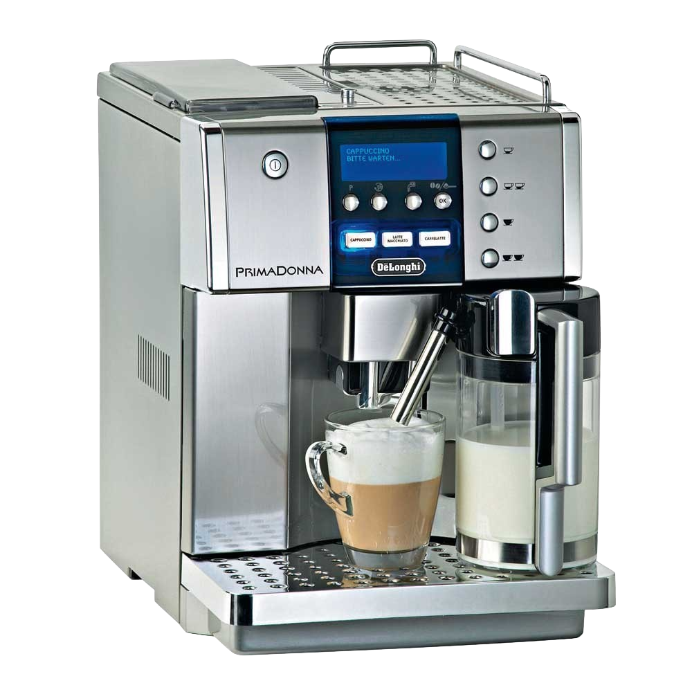
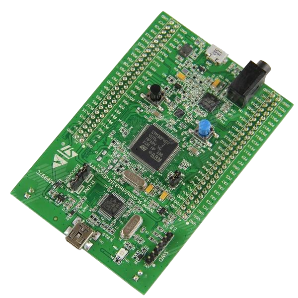
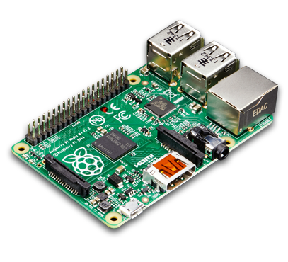
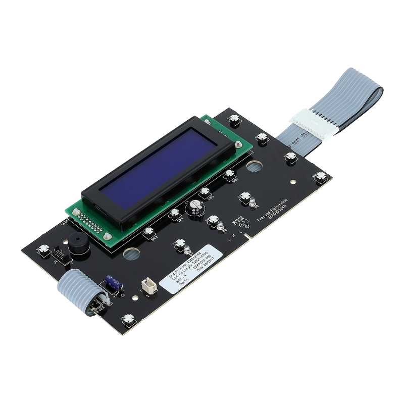
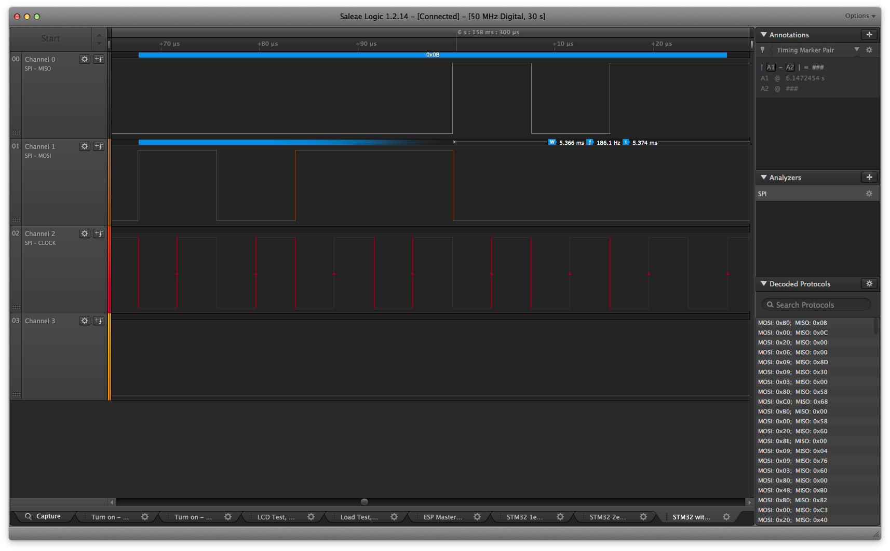
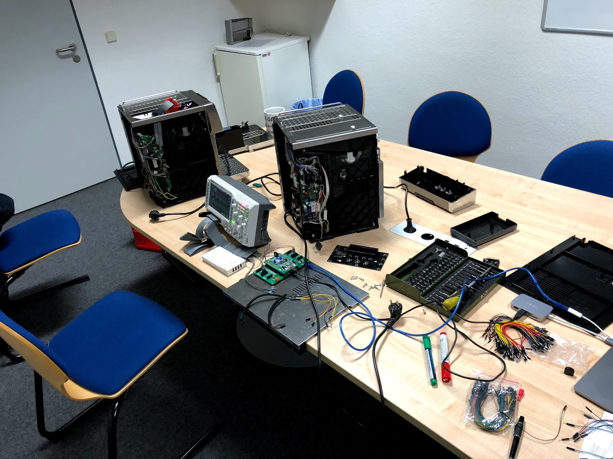
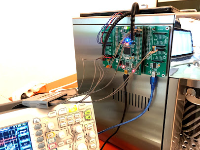

name: inverse
layout: true
class: center, middle, inverse
---
#iot-coffee-machine
.image-home[]
.footnote[Fabian Off, 22.11.2017]
---
## What is it and why should I be using it?
---
layout: false
.left-column[
  ## What is it?
]
.right-column[
.pull-3rd[
.image-full[]
]
.pull-3rd[
.image-full[]
]
.pull-3rd[
.image-full[]
]
.pull-right[]

An off-the-shelf coffee-machine, combined with an interface module that:

- interfaces with the machine to read and write information

- can be controlled via the network

- enables integration into a larger system of connected nodes - the *Internet of Things*

]
---
.left-column[
  ## What is it?
  ## Why use it?
]
.right-column[
In offices where coffee-machines are shared, there are a set of repeating problems:

- machine runs out of beans

- machine runs out of water and needs to be refilled

- filters need to be replaced

Some even need planning in advance to counter shipping times:

- beans run out of stock

- filters need to be repurchased

]
---
.left-column[
  ## What is it?
  ## Why use it?
  ## What can it do for me?
]
.right-column[
Getting network access to the machine would allow to solve these issues by:

- notifying users of upcoming cleaning or lack of supplies

- estimating consumption and scheduling restock-orders

- replacing a list, manually tracking coffee-consumption by an app

]
---
template: inverse

## How does it work, then?
---
.left-column[
  ## System architecture
]
.right-column[
.center[
<pre><code>   +-------------+         
   |             |         
   | LCD / BTNs  |         
   |             |         
   +------^------+         
   |                
   |                
   +-------+-------+        
   |               |        
  +----> Power / Logic +---+    
  |    |               |   |    
  |    +-------+-------+   |    
  |            |           |    
  |            |           |    
 +-----+---+  +-----v----+  +---v----+
 |         |  |          |  |        |
 | Sensors |  |  Heating |  | Pumps/ |
 |         |  |          |  | Valves |
 +---------+  +----------+  +--------+
</code></pre>
]
The machine seperates concerns through different components:
- **Input/Output**: LCD-Board

- **Management**: Powerboard

- **Actors**: Heating, Valves and Pumps

- **Sensors**: Water Tank, Temperature, Rotation
]
---
.left-column[
  ## System architecture
  ## Hardware
]
.right-column[
.pull-left[
.image-full[]
]
.pull-right[
.image-full[]
]
 
Connections between LCD-Board and Powerboard:
<pre><code>+---------------+                        +-----------------+
|               <------------------GND---+                 |
|               <------------------+5V---+                 |
|               |                        |                 |
|               |                        |                 |
|   LCD Board   +---CLK------------CLK--->   Power Board   |
|               |                        |                 |
|               +---MOSI----------MOSI--->                 |
|               |                        |                 |
|               <---MISO----------MISO---+                 |
+---------------+                        +-----------------+
</code></pre>
]

---
.left-column[
  ## System architecture
  ## Hardware
  ## Over-the-wire
]
.right-column[
.center[
.image-home[]
]
Powerboard and LCD-Board talk SPI:

- 8 Bits per byte, MSB

- Nonstandard-delay between bytes

- SPI Mode 3

 - Clock is high when inactive (CPOL = 1)

 - Data is valid on Clock Trailing Edge (CPHA = 1)
]
---
.left-column[
  ## System architecture
  ## Hardware
  ## Over-the-wire
  ## Protocol
]
.right-column[
.center[
.image-home[]
]
Fixed-length protocol, communicating state between the boards:

- Time

- All pressed buttons

- Sensor states

- Current mode

- Checksum

- More to be decoded
]
---
.left-column[
  ## System architecture
  ## Hardware
  ## Over-the-wire
  ## Protocol
  ## Man in the Middle
]
.right-column[
Proposed hardware for intercepting the connection:

<pre><code>
+---------------+                         +-----------------+
|               <--------------------GND--+                 |
|               <--------------------+5V--+                 |
|               |                         |                 |
|               |                         |                 |
|   LCD Board   +--CLK------+ +------CLK-->   Power Board   |
|               |           | |           |                 |
|               +--MOSI---+ | | +---MOSI-->                 |
|               |         | | | |         |                 |
|               <--MISO-+ | | | | +-MISO--+                 |
+---------------+       | | | | | |       +-----------------+
                        | | | | | |
                        | | | | | |
                        | | | | | |
                        | | | | | |
                        | | | | | |
                      +-+-v-v-+-+-v-+         +-------------+
                      |   M.i.t.M.  |         | RaspberryPi |
                      |    Board    <---USB--->  (openHAB)  |
                      |             |         |             |
                      |             |         |             |
                      |             |         |             |
                      +-------------+         +-------------+
</code><pre>
]
---
template: inverse

## Where does that leave us?
---
class: center, middle
.image-full[]

---
.left-column[
  ## Today
]
.right-column[
.center[
.image-home[]
]
- M.i.t.M. prototype is up and running

- Protocol is mostly decoded, valid packages can be created

- Communication can be intercepted, decoded and altered

- Only one protocol version supported
]
---
.left-column[
  ## Today
  ## Tomorrow
]
.right-column[

- Support newer version of the protocol (longer packets)

- Implement USB-UART interface for RaspberryPi

- Get openHAB up and running, implement node with services

- Develop webinterface to control and observe machine

- Create PCB in collaboration with Param Pawar and Guna Preeth
]
---
template: inverse
## Do you have any questions or regards?
---
name: last-page
template: inverse

## That's all (for now) - thanks for your time!