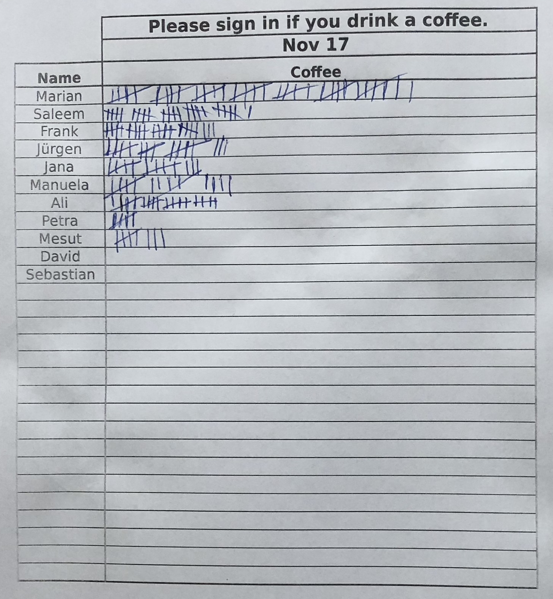
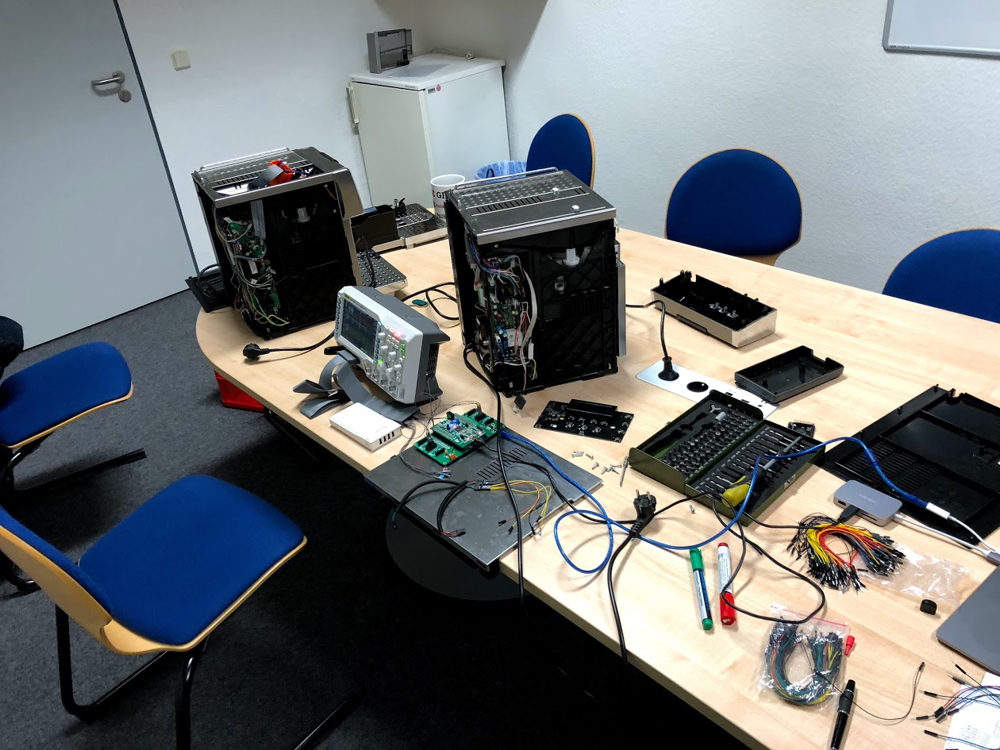
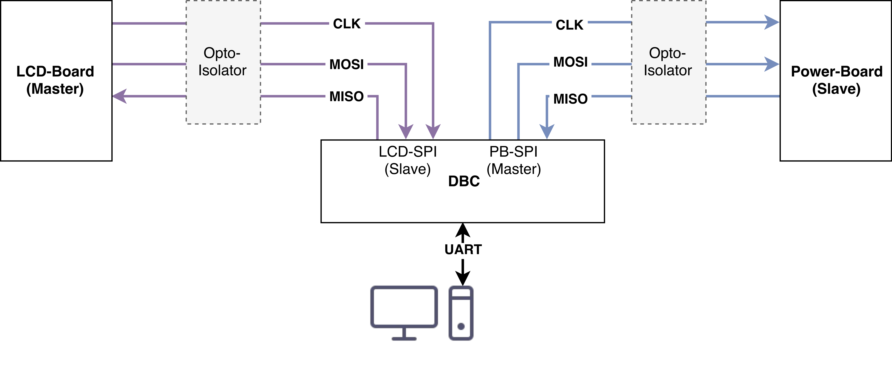
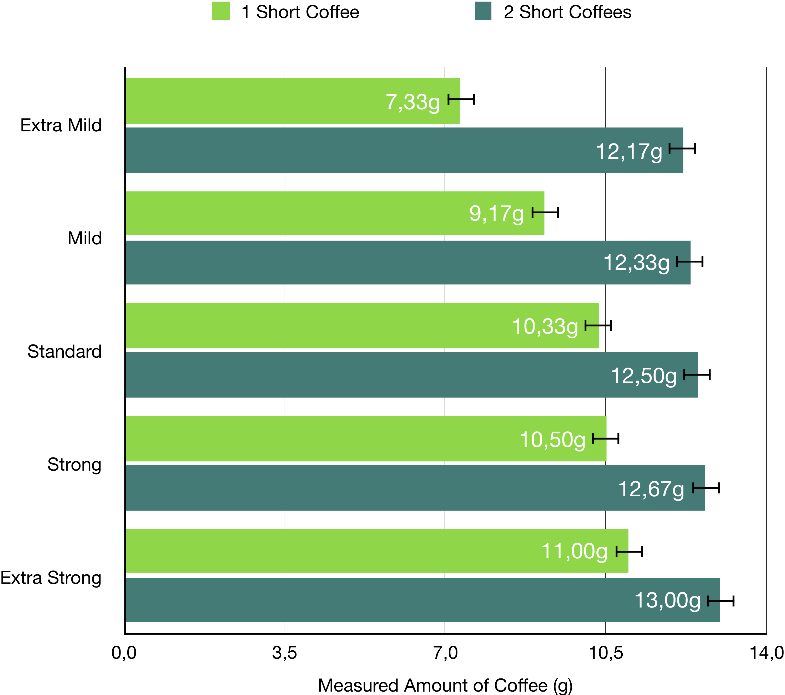
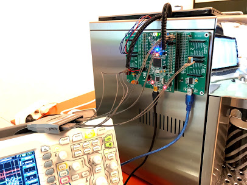
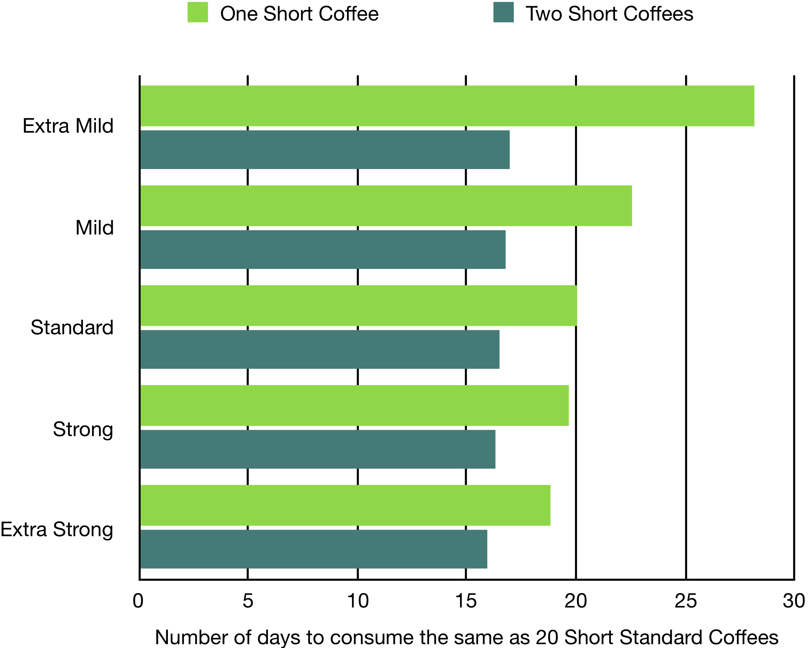

name: inverse
layout: true
class: center, middle, inverse
---
#Reverse-engineering a 
#De'Longhi Coffee Maker 
#to precisely bill Coffee Consumption
.image-home[]
.footnote[Fabian Off, 21.03.2018]
---
## Why measure coffee consumption?
---
layout: false
.left-column[
  ## Paper List
]
.right-column[
.pull-3rd[&nbsp;]
.pull-3rd[
.image-full[]
]
.pull-right[]

Tracking consumption on a paper list allows:

- allows to distribute cost (faily) across all users

- is a manual process prone to errors

- lacks any long-term reporting capabilities

]
---
.left-column[
  ## Paper List
  ## Digital Tracking
]
.right-column[
Tracking consumption digitally, on the other hand:

- runs automatically, less uncertainty

- keeps records for a long time

- allows predicting usage and the need to restock

- does need access to the machine's usage data

&nbsp;

Some machines provide a manufacturer-port, ours does not.

Thus, the machine needs to be connected to differently.

]
---
.left-column[
  ## Paper List
  ## Digital Tracking
  ## Reverse Engineering
]
.right-column[
.pull-3rd[&nbsp;]
.pull-3rd[
.image-full[]
]
.pull-right[]

Reverse engineering the machine's internal function:

- helps build an understanding of the machine's processes

- requires analyzing the electrical interface as well as the digital protocol

- enables a way of observing and interacting with the machine

]
---
template: inverse

## How to measure coffee consumption?
---
.left-column[
  ## Concept
]
.right-column[
.center[
<pre><code>
+------+    +----------------+
|      |    |                |
| User +----> Billing System |
|      |    |                |
+------+    +-------+--------+
           |
            +-------v--------+
            |                |
            | Device Driver  |
            |                |
            +-------+--------+
           |
                         +---------v------+       +---------+    
                         |                |       |         |    
                         |   De'Longhi    |       | Coffee- |    
                         | Bus Connector  +------->  Maker  |    
                         |                |       |         |    
                         +----------------+       +---------+    

</code></pre>
]
The system seperates concerns through different components:
- **Billing System**: User Interface, Orders, Reporting

- **Device Driver**: HTTP to UART Gateway

- **De'Longhi Bus Connector**: Actual Device Connection
]
---
.left-column[
  ## Concept
  ## Implementation
]
.right-column[
.center[DBC]  
.image-full[]
<!--.center[SPI]  
.image-full[]-->
]
---
.left-column[
  ## Concept
  ## Implementation
]
.right-column[
.center[DBC]  
.image-full[]
.center[SPI]  
.image-full[]
]

---
.left-column[
  ## Concept
  ## Implementation
  ## Experiments
]
.right-column[
.center[
.image-mid[]
]
Different Experiments for:

- Verifying the DBC’s capabilities

- Optimizing SPI communication speed

- Profiling the Coffee Machine
]
---
template: inverse

## Where does that leave us?
---
.left-column[
  ## Evaluation
]
.right-column[
.center[
.image-home[]
]

- Communication can be intercepted, decoded and altered

- Protocol was analyzed and decoded

- Consumption can be measured accurately

- Beverages can be <a href="javascript:run('test')">ordered</a> from a webinterface

- Cost can now be distributed **fairly** across users
]
---
class: center, middle
.image-full[]

---
.left-column[
  ## Evaluation
  ## Conclusion
]
.right-column[

Coffee consumption is now measured in gramms, rather than counts.
&nbsp;

The machine can now controlled externally, even over the web:
- <a href="javascript:enableStatus()">Status can be fetched</a>

- Machine can be turned <a href="javascript:run('resetFilters')">on</a> and <a href="javascript:run('fakeOff')">off</a> <a href="javascript:run('reset')" class="invisible" >and Reset</a>

- <a href="javascript:run('taste/normal')">Taste</a> <a href="javascript:run('taste/mild')">can</a> be <a href="javascript:run('taste/extra_mild')">changed</a>

- <a href="javascript:run('button/hot_water/')">Beverages</a> can be <a href="javascript:run('brew/one_small_coffee/extra_strong')">ordered</a>

- <a href="javascript:run('button/pwr')">Arbitrary buttons can be pressed</a>

<pre id="status"></pre>

]
---
.left-column[
  ## Evaluation
  ## Conclusion
  ## Future Work
]
.right-column[

Limitations:
- Limited User interaction with the Coffee Maker

- No physical automation regarding the mugs

- Limited set of compatible machines (right now)

&nbsp;

Future Work
- Support RFID/NFC Authentification

- Extend the Webinterface

- Act on collected Data

- Create PCB in collaboration with Param Pawar and Guna Preeth
]
---
template: inverse
## Do you have any questions or regards?
---
name: last-page
template: inverse

## That's all - thanks for your time!